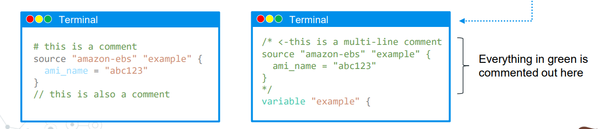
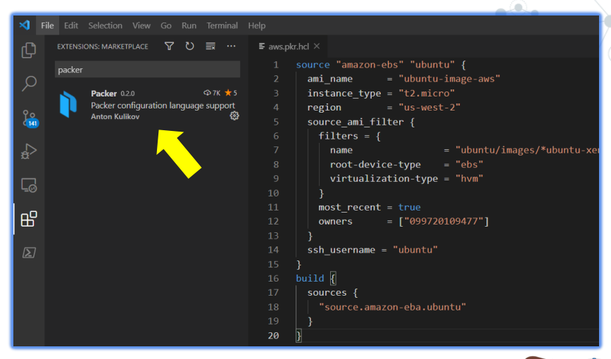
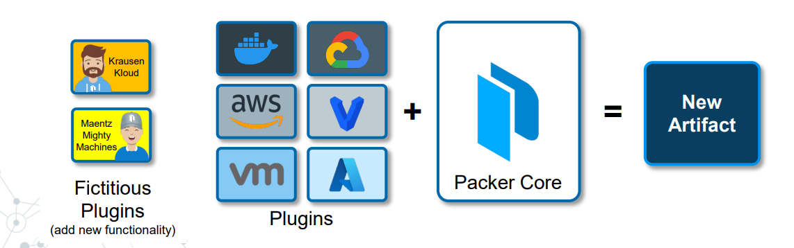

# HCL Syntax

- when we start writing the `HCL template` we have `different block` defined inside the `packer HCL template`

- the `ordering of these blocks inside the packer template` is `not significant `within our `packer template` because packer uses the `declarative model`

- `In general, the ordering of root blocks is not significant within a Packer template since Packer uses a declarative model` 

- `References to other resources` `do not depend on the order they are defined`. 

- we can simply say the `hey packer this will be the end-state` will going to `look like` , `go and build it`

- `packer` does not need to follow the `direction in step by step` approach

- `we just have to tell what end state we want to see and packer go and build that for us `

- when we have the `blocks defined` we can `referenced to the resources` `which don't necessaryly defined in the order that reference been defined ` packer will take care of that for us

- `packer template` can even have `block` that can `span over multiple packer template file`, preveiously we mentioned that we can create the `packer build` from a `directory of packer template` in that case we can refer `blocks` which been present over `another packer template file`

- by default the `order of the block inside the packer template` does not matter , but inside the `build block` the order of  `provisioner or post-processor` where the `block order does matter`

- for example :- `we can have a provisioner that can dumps a bunch of file on to the template on the image` and `post-processor is responsible to execute those script` or `move the file to somewhere else`

- we can have the `post-processor` or `provisioner` blocks inside the `build block` which might have the dependency over  `other provisioner or post-processor` , hence we can have the `cronological order` for the same

- we have to make sure to `move the files` before we execute that `particular template` over here , we neeed to make sure the `order of the p[rovisioner and post-processor` are `relative in term`

- The order of provisioner or post-processor blocks within a build is the only major feature where block order matters.

### Commenting in HCL2

- HCL2 supports comment to use throughout your configuration file

- `#` - `single line comment`

- `//` - `single line comment` 

- `/* and */` :- `start and stop delimiters – might span over multiple lines`

- 

### Syntax Highlighting

- `Plugins for HCL exist for most major editors.` 

- `VS Code Extension for Packer adds syntax support for the Packer HCL configuration language.` 

- 

- this particular `extension` is not `super great` , we can see `somne of the data blocks` inside the `packer template` being `highlighted as red`  , here also we need to change the file type to `*.hcl` then rest it will take care


### Interpolation Syntax


- `interpolation syntax` is a `Trraform/HCL Thing` that been pulled from `Terraform`

- `Like Terraform, we can use interpolation syntax to refer to other blocks within the template`

- we can reference `other blocks` inside the `packer template` , this will allow us to `organize our code very nicely`

- the key thing is , it will let us to `reuse` the `values` which is `already being defined`

- example:- 

    ```packer

        data "amazon-ami" "amazon-linux-2" { # defining the data block in this case out here
        most_recent = true # Selects the newest created image when true
        owners      = ["amazon"] # Filters the images by their owner

        filter { # here using the filter to filter out the ami over here with the name and values pair
            name   = "name" 
            values = ["ubuntu/images/*ubuntu-xenial-16.04-amd64-server-*"]
        }

        filter { # here using the filter to filter out the ami over here with the name and values pair
            name   = "virtualization-type"
            values = ["hvm"]
        }
        }

        variable "aws_region" { # defining the variable block in here
            description = "The AWS region in which to launch the resources." # defining the description of the block here
            type        = string # here defining the type of the variable over here
            default     = "us-east-1"  # Update with your desired default region
        }

        variable "subnet_id" {
            description = "The ID of the subnet in which to launch the resources."
            type        = string
            default     = "subnet-1234567890abcdef0"  # Replace with your actual subnet ID
        }

            variable "vpc_id" {
            description = "The ID of the VPC in which to launch the resources."
            type        = string
            default     = "vpc-0123456789abcdef0"     # Replace with your actual VPC ID
        }


        source "amazon-ebs" "amazon-ebs-amazonlinux-2" {

            ami_description = "Vault - Amazon Linux 2" # The description to set for the resulting AMI(s)
            ami_name = "vault-amazonlinux2" # The name of the resulting AMI that will appear when managing AMIs in the AWS console or via APIs
            ami_regions = ["us-east-1"] # A list of regions to copy the AMI to
            ami_virtualization_type = "hvm" #The type of virtualization for the AMI you are building
            associate_public_ip_address = true #If using a non-default VPC, public IP addresses are not provided by default. If this is true, your new instance will get a Public IP. default: unset
            force_delete_snapshot = true #Force Packer to delete snapshots associated with AMIs
            force_deregister = true #Force Packer to first deregister an existing AMI if one with the same name already exists. Default false
            instance_type = "t2.micro" # The EC2 instance type to use while building the AMI, such as t2.small
            region = var.aws_region # referencing the variable block in here
            source_ami = data.amazon-ami.amazon-linux-2.id # referencing the data block which been used for querying 
            tags = { # defining the Tags as key=value format over here
                    Name = "HashiCorp Vault"
                    OS = "Amazon Linux 2"
                }
            subnet_id = var.subnet_id #If using VPC, the ID of the subnet
            vpc_id = var.vpc_id # If launching into a VPC subnet, Packer needs the VPC ID in order to create a temporary security group within the VPC

        }

        build { # defining the builder details over here
            sources = ["source.amazon-ebs.amazon-ebs-amazonlinux-2"] # defining the sources for the same
            provisioner "file" { # defining the file provisioner
                destination = "/tmp/vault.zip" # defining the destination where we want to see the file
                source = var.vault_zip # defining the source for the same
            }
        }


    ```

- here in the `example` inside the `build block` we are referencing to the `source block` as `["source.amazon-ebs.amazon-ebs-amazonlinux-2"]` which is defined as the `source block` inside the `packer template` , as the `source block` been defined we can `reference or reuse` that inside the `build block` rather than `rewritting`

- here we are also define the `source image AMI for the instance in order to create packer custom gloden image` that we want to use as the `data block` as `data.amazon-ami.amazon-linux-2.id` here the `data block` will query the `particular source AMI image` return the `AMI ID` , we can also get `other additional info` from the `data query` such as `id/name`

- by using the `interpolation syntax` we can retrieve the data from `other block` and we can refer to the `data`


### Plugin Architecture of packer

- `Builders, provisioners, post-processors, and data sources are simply plugins that are consumed during the Packer build process`

- `This allows new functionality to be added to Packer` `without modifying` the `core source code`

- we have the `packer core` which is the `packer binary` i.e `initial packer source code` that we habe got while installing packer

- `we want to add the plugin in order to interact with remote backend` such as `AWS/Azure/Docker/VMWare/Vagrant`

- here we are using the `packer plugin` on top of the `packer core` in  order to interact with the `remote backend API`

- bith the `packer core` + `packer plugin` which will provide the `desired functionality` that can be as `new artifact`
  
  - if we are using the `VMware` machine then the `New Artifact` can be the `new VMware template`
  
  - if we are using the `AWS` then the `registered AMI` will going to be `new Artifact` depending on the backend platform
  
  - each `remote backend plugin`  can have different type of `plugin that we can use`
  
- if we are `New Public cloud which can be used as remote backend plugin` we can extend the `packer core` functionality to `create new artifact`  , without touching `packer core`

- 