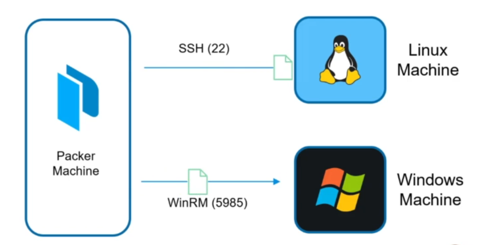

# working with packers core component in HCL 

- `all different core component of packer template` and `How that fit` into `HCL format`

- the `core component` of `packer solution` are of 
  
  - `source`
  
  - `builders`
  
  - `provisioners`

  - `post-processors`
  
  - `communicators`
  
  - `variables`   


- here we will learn `how to write each of the core component block or feature` using the `HCL template`

- **How to write the source block using the HCL syntax**

- `source blocks` are only `available in HCL packer template` , if we are using the `JSON packer template` then we are not able to use the `source template`

- it is only `exclusive` to the `HCL packer template`

- `source block` define the `initial image` to `use to create your customized image` , `how to launch the image`, and `how to connect to the image`

- if we writing the `source block` we can define as below , where in production we can have multiple args or parameter inside the `source block`

    
    ```packer
        source "amazon-ebs" "ubuntu" { # here we are using the source block with amazon-ebbs as the source type

            ami_id= "ami-a1b2c3d4e5" # source image id that we are going to reference in here
            region = "us-east-1" # defining the region where the custom image going to be get created
            instance_type = "t2.micro" # defining the type of instances we will be using

        }
    
    ```

- we can use the `source block` with `lot of info` in order to `grab the initial image`

- source block also going to define `which type of virtualization that we are going to define for the image`

- here we will also define the `how to lauch the image` , here on the below example we will be using the `amazon-ebs` as the `builder` in order to lauch the `traditional EC2 instance` that been backed by `amazon ebs service`

- we will be going to `launch the t2.micro AMI` and lauch that in `t2.micro` ami into the `us-east-1 region`

- there can be bunch of `different paramerter` depending on the `individual source image block`

- source block also going to define `how to connect to the image` as well `to do what we want to perform` before creating the `final artifacts` or `final custom image`

- `In the example, the SSH communicator is used to allow Packer to SSH into the EC2 instance`

- we can define the `another packer source block` as below 

    
    ```packer

        aws-ubuntu.pkr.hcl
        ==================

        source "amazon-ebs" "ubuntu" {

            ami_name = "ubuntu-image-aws" # defining the ami name that will be registered
            instance_type = "t2.micro" # defining the instance type for the ami image
            region = "us-east-1" # defining the region as us-east-1
            source_ami_filter  { # defining the source_ami_filter to select a particular AMI
                filter = { # providing the filter to fetch the values 

                    name = "ubuntu/images/*ubuntu-xenial-16.04-amd-server-*"
                    root-device-type = "ebs"
                    virtualization-type = "hvm"

                }
                most_recent = true
                owners = ["099720109477"]
            }
            ssh_username = "ubuntu" # using this ssh packer can communicate with the source image

        }
    
    ```

- **how to use the build block inside the packer HCL template**
  
- `Build blocks` are `used in tandem with source blocks` and `define what Packer should do with the image after it is launched the image` in the `remote Backend Platform`

- `The example template below will be used to build an AWS Ubuntu AMI in the us-west-2 region.` 

- `It references the AMI defined in the source block`.

    
    ```packer
        aws-ubuntu.pkr.hcl
        ===================

        source "amazon-ebs" "ubuntu" {

            ami_name = "ubuntu-image-aws"
            region = "us-west-2"
            instance_type = "t2.micro"
            source_ami_filter {
                filters = {
                    name = "ubuntu/images/*ubuntu-xenial-16.04-amd-server-*"
                    root-device-type = "ebs"
                    virtualization-type = "hvm"
                }
                most_recent = true
                owners = ["099720109477"]
            }
            ssh_username = "ubuntu"
            build {
                sources {
                    "source.amazon-ebs.ubuntu" # referencing the source block from the build block using the sources in here
                }
            }
        } 
    

    ```

- **How to configure the Provisioner inside the HCL template**

- `Provisioners` `install and configure` the `machine image` `after it reboots`.

- `You would use one or many provisioners to customize the image as needed.`

- in the `HCL packer template` the `provisioners` were `embeded inside the build block`

- we can have `file/shell` provisioner inside the `packer HCL template` under the `build block` here

- the `provisioner block` will `execute` by the `order they been defined inside the build block of the packer template`

- here is the example reference for the same 

    ```packer

        google-compute.pkt.hcl
        ======================
        build {
            sources = ["sources.googlecompute.debian-build"]
            
            provisioner "file" { # defining the file provisioner in here as file to upload the file into the tmp directory
                destination = "/tmp"
                source = "files"
            }
            provisioner "shell" { # defining the shell provisioner with the script file path to run after the machine-image reboot
                script = "scripts/setup.sh"
            }
            provisioner "shell" { # defining the shell provisioner with the inline command to run after the machine-image reboot
                inline = ["echo ${var.deployment_version} > ~/DEPLOYMENT_VERSION"]
            }
        }

    
    ```

- **How to configure the Post-Processor inside the HCL template**

- `post-processors` are very similar to `provisioners` that we have `discussed above`

- `post-processors` are defined `underneath the build block` in the `packer HCL template`

- `Post-processors` can be `used to specify` `what to do after the image is created` 

- `Post-processors`  are `Part of the build block ` and `is not mandatory.`

- we can perform the `clean up of the script` that we executed using the `provisioner` inside the `post-processors` 

- we can define the `post-processors` as below 

    
    ```packer

        build {

            sources {

                "source.amazon-ebs.ubuntu" # here referecing the souce block from the build block over here

            }
            # here we are removing the script that provisioner executed in here
            post-processor "shell-local" { # defining a post-processor with the name as shell-local

                inline = [ # defining the inline command in here which should be executed when the image getting created

                    "rm /tmp/script.sh" # removing the script from the /tmp directory


                ]

            }

        }
        

    
    ```

- **communicators and How to Use them inside the packer Template**

- `communicators` are the `mechanism or the way` using which `packer` can `upload the file` and `execute the sscript` and `run command` against the `machine image`

- `communicators` are configured inside the `source block` inside the `packer template`

- we have `3 type of communicators`
  
  - `ssh-(default)`
  
  - `WinRM`
  
  - `Build-specific(docker exec)` 

- here the `ssh` is the `default communicator` inside the `packer` , hence if we are using the `ssh communicator` we need not have to define the `communicator type` inside the `source block`

- `WinRM` which been used for the `windows` 

- we have `builder-specific comminicator` such as `docker exec` , if we are using `packer` in order to create the `docker images`  

- on thge below picture we have the `packer machine` which will be `building the packer image` , `packer machine` need to comminicate with the `machine image` on the right using the `correct communicator`

- for the `linux machine image` we will be communicating using the `ssh over the port 22`

- for the `windows machine image` we will be communicating using the `winRM for the port 5985/5986`

- 

- **How to use the communbicator inside the packer HCL template**
  
- we can define that as below where we have the `source block` which we are building the `centOS` image out in here 

- here as we are using the `Linux machine image` hence we don't have to specify the `comminicator` as `ssh` in this case

- here the `ssh_username` is the `username` with which `packer machine` will comminicate with ` linux machine image` using port `22`


    
    ```packer

        aws-centos.pkr.hcl
        ==================

        source "amazon-ebs" "centos" {

            ami_name = "packer-centos-aws-{{timestamp}}" # defining the ami_name for the custom machine image

            instance_type = "t2.micro" # defining the size of the image that we are going to use

            region = "us-west-2" # defining the region as us-west-2 over here for the source image

            ami_regions = ["us-west-2"] # defining in which region we want to put the custom machine image

            source_ami_filter { # defining the source_ami_filter filter the source ami which to be used

                filters = { # defining the filter in here 

                    name = "CentOS Linux 7 x86_64 HVM EBS *" # name of the source image
                    product-code = "aw0evgkw8e5c1q413zgy5pjce" # product code of the source image to filter
                    root-device-type= "ebs" # root-device-type for the source image
                    virtualization-type= "hvm" # defining the virtualization type in here

                }

                most_recent = true # if there were multiple AMI selected choose the latest one
                owners = ["679593333241"] # providing the owner name for the same

            }

            ssh_username = "centos" # using the source name using which we wnat to communicate

        }

    

    ```

- if we have to define the `source block for windows machine image` with the `communicator` then we can define that as below 

- here as we are using the `Windows Machine image` we need to define the `communicator` as `winRM` is not the `default communicator` and `winrm_insecure` and `winrm_use_ssl` in here 

- here the `winrm_username` with which `packer machine` will communicate with the `Windows machine image` on port `5985/5986`

    
    
    ```packer

        aws-windows.pkr.hcl
        ===================

        source "amazon-ebs" "windows-2012r2" { # defining the Source block for the windows 2012 R2 Server over here

            ami_name = "my-windows-2012-aws-{{timestamp}}" # defining the ami_name for the custom machine image

            communicator = "winrm" # defining the type of communicator that we are going to use in here 
            
            instance_type = "t2.micro" # defining the instance_type over in here 
            
            region = "us-east-1" # defining the region fore the source ami image

            source_ami = "${data.amazon-ami.windows_2012r2.id}" # fetching the ami_id using the data block and referencing over here 

            user_data_file = "./scripts/SetUpWinRM.ps1" # setting up the WinRM using the script here

            winrm_insecure = true # defining the winrm as insecure as true here
            
            winrm_use_ssl = true # defining the winrm_use_ssl as true here  for the communicator
            
            winrm_username = "Administrator" # defining the username with which we want to communicate to the windows machine

            tags = { # defining the tags over here

                "Name" = "MyWindowsImage"
                "Environment" = "Production"
                "OS_Version" = "Windows"
                "Release" = "Latest"
                "Created-by" = "Packer"
            }


        }   


    ```

-  **variables and How to Use them inside the packer Template**

- You can use `input variables (aka variables)` or `local variables (aka locals)` to `define values for arguments throughout a Packer template`

- when we define the `variables` inside the `packer template` we can have `different variable block` in here 

- `each of the variable block` will going to define the `variable name` in this case 

- we can define the `type` and `default value` for the `variable` in this case 

- while defining the `variable` we need have to define `type or  default` value mandetoryly , will see in the variable section of it

- `user` can able to change the `default value of the variable defined in the variable block`

- we can also use `validation` while defining the `variable` inside the `packer HCL template`

- we can define the `variable block as below`

    
    ```packer

        
        variable "subnet_id" {
            type = string
            default = "subnet-1a2b3c4d5e" # defining the default values for the subnet_id here
        }
        
        variable "region" {
            type = string
            default = "us-east-1" # defining the region over here as well
        }

        source "amazon-ebs" "amazon-linux2" { # here defining the amazon-ebs resource type here

            ami_name = local.ami_name
            # defining the ami_name over here for custom machine image
            instance_type = "t3.medium"
            # defining the instance_type over here
            region = var.region 
            # referencing the region over here 
            source_ami = data.amazon-ami.amazon-linux.id
            # defining the source_ami for the source ami id here 
            ssh_username = var.ssh_username
            # defining the ssh_username over here for the ssh communicator
            subnet_id = var.subnet_id
            # defining the subnet_id over here 
            tags = { # defining the tags over here
                Name = local.ami_name
            }
            vpc_id = var.vpc_id # defining the vpc_id here 

        }
            
    
    ```