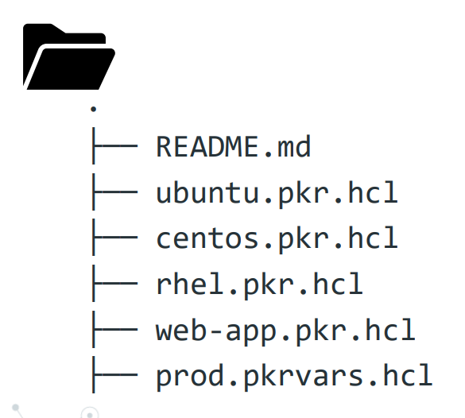
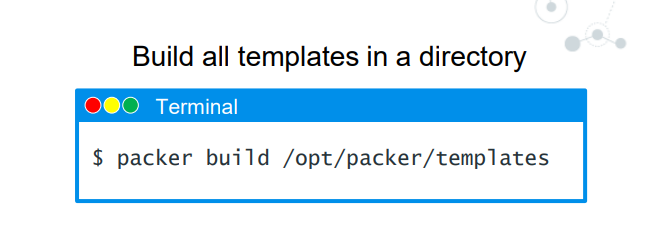

# Writing Packer Template

- what is a `packer template` ?
  
  - here in a `packer template` will define the `core-functionality` and `behaviour` that we want to use with `packer`
  
  - a `template` will consist of `different declaration and command` such as 
    
    - `What plugin we want to use`
    
    - `how to configure individual plugin`
    
    - `In what order do we need to run the plugin`
    
    -  the `indivisual core component` that we want to use such as `builders, provisoners,post-processors` that being the `part of the packer template` is considered as `plugins` that we need to `pull in and extend its functionality`
    
  - packer currently support 2 type of language such as `JSON` or `HCL(Hashicorp Configuration Language)` , but here we will learn about the `packer using the HCL command`
  
  - `HashiCorp is moving to  HCL2 as the standard format for Packer 1.7+` , `where JSON is the standard format preveious versions` 
  
  -  HCL is designed to strike a balance between `human-readable` and `machine-parsable` , if we are using the `packer template` then we can easily deduce `whats its been doing on the background` , `Packer templates are very easy to develop and read`
  
  - `If you have Terraform experience, Packer templates are going to look very familiar` , `HCL is the same configuration language as Terraform and other  HashiCorp products`


### HCL formatting 

- `Configuration format of hcl` is `VCS (gitlab/GitHub/Azure Repo) friendly` :- which support as 
  
  - `multi-line list`
  
  - `trailing commas`
  
  - `auto-formatting`  

- while writing `HCL` the only `code blocks` we can use `that are build directly into the hashicorp configuration language` , we can't define the `user defined blocks` in that case

- `Only code blocks built into the HCL language are available for use` , we are kind of stuck what they provide to us

- `Packer uses a standard file name for simplicity` as `<name>pkr.hcl`

- while writing the `packer template` we need to use the `Uses Syntax Constructs like Blocks and Arguments` , we will look into that next

-  `New features will only be implemented for the HCL format moving forward `, currently `Hashicorp packer` added the `source block` which is only available in `HCl not in JSON`


### HCL Syntax

- when we tak about the `HCL Syntax` ,  we know that `packer template` were build using the `blocks` and `arguments`

- when we define the `block` then we can define 
  
  - `block type such as (build block, source block)`
  
  - we also have to define a `1st block label` and that `label is going to define some of the functionality` (is it Azure/AWS/GCP ? is it File or Shell Provisioner? )
  
  - the `1st block label` tells u8s `what type of block its going to be` 
  
  - the `block label` at the end is the `name of the block` we can call this `anything` , `that name will be used while using` the `variable interpolation`
  
  - underneath each block we have `one or more argument` `depending on what type of blocvk we are using`
  
    - such as 
      
      - for example inside `source block`  we can use `args` such as `this is the image we want to use it as source`  or `ssh_username for the image inside the source block`
      

### HCL File Structure

- the `file struicture` we can use while using the `packer template`
  
  - `underneath a single directory` with `any name` we can store the `all HCL template file`
  
  - we can store it as below 

  - 
  
  - if we want to create the `packer build` from all the `template` then defining all the `packer template` inside the `single directory` , we can simply fo `packer build <directory where all packer template being stored>` as below 
  
  - this will be more useful when we are defining the `variables` inside the `<name>.pkrvars.hcl` file in here or we can also use the `block type reference` throughout `different files` , we can define all these template in a single call

  - 
  
  - if we want to build a single template then we can use the command as `packer build <packer template>` and packer will go and `build the template` for you
  

# HCL Example

- here is the `packer template` in reference that we have seen in here 

- here inside the `source block` we can see different type of args such as 
  
  - `ami_name`
  - `instance_type`
  - `region`
  - `source_ami_filter`
  - `ssh_username`
  - `subnet_id`
  - `tags`
  -  `vpc_id`

- we have the `builod block` which has `different argument` such as 
  
  - `sources` 

- we can also have different `provisioner` such as 
  
  - `file-provisioner`
    
    - `destination`
    - `source`

  - `shell-provisioner` 
    
    - `script` where we define the sript location to use 

    
    
    ```hcl
        aws-ubuntu.pkr.hcl
        ==================

        source "amazon-ebs" "aws-example" { # defining the source block with block type as amazon-ebs and label as "aws_example"
          
          ami_name = "${var.ami_name}" #defining the name provided to the AMI once registered

          instance_type = "t3.medium" # defining the instance_type as t3.micro in this case
 
          region = "us-east-1" # defining the region over here 

          source_ami_filter {

              filter = {

                  name = "${var.source_ami_name}" # defining the name of the ami that we want to filter
                  root_device_type = "ebs" # defining the root_device_type as ebs over here 
                  virtualization_type = "hvm" # defining the virtualization_type as hvm in here 


              }
              owners = ["amazon"] # defining the owners as the amazon in this case
              
          }
          ssh_username = "ec2-user"
          subnet_id = "${var.subnet_id}" # defining the subnet IS that we are going to create
          tags = { # defining the tags in this case

              Name = "${var.ami_name}" # using the ami name from the variables as the Tags

          }

          vpc_id = "vpc-1234567890" # defining the vpc ID in this case 

        }

        build { # defining the build block over here 

          sources = ["source.amazon-ebs.autogenerated"] # referencing the source block defined abovre

          provisioner "file" { # defining the provisioner as the file provisioner in this case 

            destination = "/tmp"

            source = "files" 


          }

          provisioner "shell" { # defining the shell provisioner in this case
            
            script = "scripts/setup.sh" # defining the shell script out in here
          
          }
          
          provisioner "shell" { # defining the shell provisioner in this case out in here 
            
            script = "scripts/vault.sh" # defining the shell script out in here
          }

        }

  
  
    ```

- here is the `example of JSON format of the Packer Template ` as below 

- all the variables been declared under the `single variable block` in this case 

- while defining the `variables in hcl` we can define that as `with the name, description and constraint and type`

- but in `JSON` there is no `support there for the same` , we can define the `variables with name and value only` 

  
  ```json
      aws-ubuntu.json
      ===============
      {
        "variables": {
        
          "ami_prefix": "amzn2",
          "ami_name": "{{user `ami_prefix`}}-{{user `app_name`}}-ent-{{user `consul_version`}}-{{timestamp}}",
          "region": "us-east-1",
          "vpc_id": "vpc-1234567890",
          "subnet_id": "subnet-1234567890",
          "ssh_username": "ec2-user",
          "source_ami_name": "amzn2-ami-hvm-2.0.20200304.0-x86_64-gp2",
          "source_ami_owner": "amazon"
        },
        "builders": [{
          "type": "amazon-ebs",
          "region": "{{user `region`}}",
          "vpc_id": "{{ user `vpc_id`}}",
          "subnet_id": "{{ user `subnet_id`}}",
          "source_ami_filter": {
              "filters": {
              "virtualization-type": "hvm",
              "name": "{{user `source_ami_name`}}",
              "root-device-type": "ebs"
        },
          "owners": ["{{user `source_ami_owner`}}"]
        },
        "tags": {
          "Name": "{{user `ami_name`}}"
        }
        }],
        "provisioners": [
          {
          "type": "file",
          "source": "files",
          "destination": "/tmp"
          }
          {
          "type": "shell",
          "script" : "scripts/setup.sh"
          }
          {
          "type": "shell",
          "script" : "scripts/vault.sh"
          }
        ]
      }

  
  ```

### Converting Old Templates to HCL

- if we have the `older style JSON formatted packer template` then we can convert it to `HCL format` using the command as `packer hcl2_upgrade <JSON template for packer>`

- if we do that then `All fields of builders, provisioners and post-processors have a 1:1 correspondence with a few exceptions.` 

- these `exception will be handled with latest pascker version`